# Partly Hidden Object Detection

## The Problem
Object detection is detecting instances of semantic objects of a certain class (such as humans, buildings, or cars) in digital images and videos, and putting bounding boxes around them. 

The problem we solved is Object Detection for images where the objects are partly hidden by patches.  
We worked on three different kinds of patches - black, average and background. Black patches are simply multiple black rectangles (random height and width from normal distribution) which hide parts of the image, including parts of the objects themselves. Average patches are similar to black patches, except their color is the mean color of all the pixels of all the images in the dataset (turned to be (102,113,103) in RGB which is gray). Background patches are similar to those two except instead of solid color, they consist of parts of the image background (background = not part of any object in the picture). Inside the black patches department, we worked on two sub datasets, which include many small black patches in the first one, and few big ones in the second.

We splitted each of the above datasets (small black patches, big black patches, background patches, average patches) into two types - 1 and 2. In type 1 we didn’t modify the original ground truth bounding boxes, while in type 2 we modified those ground truth bounding boxes to fit the visible parts of the objects with the patches. In both types, if more than 90% of the object is hidden, we removed his bounding box from the ground truth and we wouldn’t want him to affect our results (as a human would probably not recognize it either).

To compare the results, we used the original dataset without any modification to compare to.  
In the following images we can see all five kinds of images: origin, background patches, small black patches, big black patches and average patches. The comparison isn’t perfect because the black patches are in big and small sizes while the average and background patches are medium sized. We couldn’t test all options since there would be too many datasets and models. Future work could test the effect of all of those parameters on datasets, models and more.

 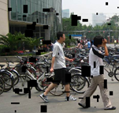 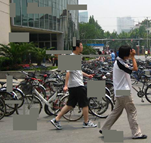  

 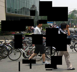

We evaluated our 9 (2x4+1) models via mAP (mAP=111 RecalliPrecision(Recalli)).  
Each model will be evaluated on all 9 datasets and our goal is to see whether training the model on ‘harder’ datasets will help him perform better on the ‘easier’ one (origin).

## Related Work
The article Hide-and-Seek: A Data Augmentation Technique for Weakly-Supervised Localization and Beyond by Krishna Kumar Singh, Hao Yu, Aron Sarmasi, Gautam Pradeep and Yong Jae Lee presents a way to do augmentations by adding black patches to the picture, and classify the image into classes (one class per image). They handled multiple tasks among classification and bound the object. They used one-sized patches and had a single object per image. They used the same image multiple times during training with different patch locations in order to train the model to classify based on different parts of the object (the visible ones which were different in each augmented image). They replaced the black color with a solid color which was the mean of all pixels. They did it so that the mean of the testset will be close to the training set one and the model would generalize better. The idea to make average patches came from this article, we wanted to compare it to black and background patches.

## The Method
### The Model Architecture
We used a Faster RCNN model, with resnet50 as it’s backbone.  
Faster RCNN is an object detection architecture presented by Ross Girshick, Shaoqing Ren, Kaiming He and Jian Sun. It is composed of 3 main parts - 3 neural networks, each responsible for different tasks. The first component is the Feature Network which is responsible to generate features from the given images to the next components. The second component is Region Proposal Network (RPN) which is responsible for returning areas in which it believes there are objects. The third component is the Detection Network which is responsible for generating the final results using the two previous components output. It generates bounding boxes and classifies the objects in them.  
We trained 9 Faster RCNN models, one for each of the datasets that we described above.

### Loss function
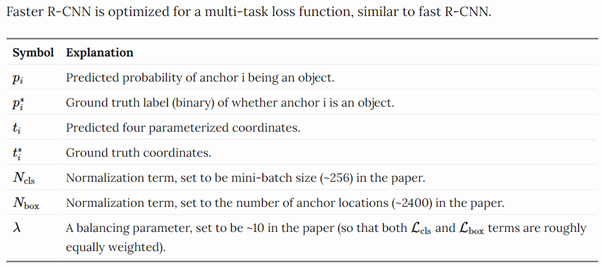

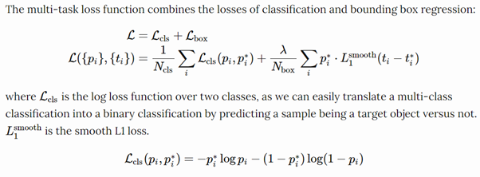

### Creating The Patches
As we described above, we created 8 new datasets with patches. The number of patches was taken from the following uniform distributions: small-black - [50,75], big-black - [15,25], background and average - [20,30]. The sizes (width and height) of the patches were taken from the following normal distributions (in the form of (mean, std), woi = width of image, hoi = height of image): small-black - width (woi32,woi32), height (hoi32,hoi32), big-black - width (woi10,woi10), height (hoi10,hoi10), background and average - width (woi16,woi16), height (hoi16,hoi16). The positions of the patches were uniformly distributed among all possible positions in the image.  
The background patches were selected from uniform positions across the original image, and verified with the mask of the image that they do not intersect with any objects, and then added to the image as explained above. If the verification failed, we tried again (limited by 25 tries).
To get the average color we summed all pixels of the dataset and divided by the number of them.  
The masks are matrices that define for each pixel the object it is a part of (0 = background, 1 = the first object, etc.). The ground truth bounding boxes are calculated via the mask to be the smallest box that contains every pixel of the object (different bounding box for each different object). While adding patches we created a new mask for each image where pixels that are hidden by a patch got the value 0, meaning part of the background and not the object itself.  
For both types 1 and 2 if an object was more than 90% hidden (we checked using the new mask), we removed his bounding box from the ground truth. For type 2 only we updated the mask in the dataset to be the new calculated mask, while for type 1 we only used it to get the 90%+ covered objects out. That way, in type 1 the bounding boxes will cover the original objects, while in type 2 the bounding boxes will cover only the visible parts of the objects (hidden parts might be part of the box if they are surrounded by visible parts, but they won’t define the borders of the box).

### The Dataset
We used the Penn-Fudan Database for Pedestrian Detection and Segmentation which consists of 170 images. We splitted it into 3 sets (the same for each model): train set with 90 images, validation set with 30 images and testset with 50 images. It has only one class, ‘human’ class (and background). This dataset supports segmentation tasks as well, so it had the masks which we used when creating patches.  
At first, we intended to use the COCO dataset, and train the models from scratch on the modified datasets we create (patches). But we needed too much computing resources which were not available for us, and each epoch would take many hours. So, we decided to finetune a pretrained model for each of the datasets. We couldn’t finetune on the COCO dataset since the pretrained model was trained on the same dataset. If we would evaluate the model on the same dataset the results would be much better than they should, since the same image might have been seen before by the model.

## Results
model   \   dataset | origin | sbp 1 | sbp 2 | bbp 1 | bbp 2 | bkg 1 | bkg 2 | avg 1 | avg 2
--- | --- | --- | --- | --- | --- | --- | --- | --- | --- 
origin | 0.82 | 0.795 | 0.755 | 0.457 | 0.533 | 0.706 | 0.723 | 0.671 | 0.687
small black patch 1 | 0.822 | 0.797 | 0.8 | 0.609 | 0.643 | 0.744 | 0.736 | 0.73 | 0.754
small black patch 2 | 0.818 | 0.791 | 0.789 | 0.603 | 0.649 | 0.74 | 0.74 | 0.704 | 0.732
big black patch 1 | 0.786 | 0.748 | 0.761 | 0.674 | 0.611 | 0.725 | 0.717 | 0.739 | 0.736
big black patch 2 | 0.81 | 0.781 | 0.783 | 0.673 | 0.671 | 0.745 | 0.732 | 0.745 | 0.76
background patch 1 | 0.813 | 0.782 | 0.767 | 0.639 | 0.622 | 0.757 | 0.728 | 0.735 | 0.75
background patch 2 | 0.796 | 0.787 | 0.773 | 0.607 | 0.632 | 0.739 | 0.729 | 0.736 | 0.742
average patch 1 | 0.808 | 0.782 | 0.772 | 0.653 | 0.617 | 0.746 | 0.732 | 0.776 | 0.766
average patch 2 | 0.791 | 0.753 | 0.731 | 0.592 | 0.584 | 0.713 | 0.705 | 0.721 | 0.734

sbp = small black patch, bbp = big black patch, bkg = background, avg = average.  
This table shows the test evaluated mAP results. Every column is the results of each model on a specific dataset, while every row is the results of a specific model on all the datasets.

### Per Type Results
In the diagonal of the table we can see the mAP for each testset and the model trained on the same type of data. The minimum result of this kind is 0.671 which indicates that each model solves the problem he was trained on with good performance. The best results of this kind are on the origin (0.82), which is not surprising since it’s the ‘easiest’ data to learn. After that, we’ve got both small black patches datasets (1: 0.797, 2:0.789), then the average patches (1: 0.776, 2:0.734) and background (1: 0.757, 2:0.729), and lastly the big black patches (1: 0.674, 2:0.671). We can see that the bigger the patches are, the mAP is lower (with minor difference between average and background) which indicates it is a ‘harder’ task.

### 1 VS. 2
In general, the model trained on type 1 of a dataset performed slightly better than type 2 of the same dataset. Each model that was trained on type 1 dataset was the best for it’s testset. For type 2 on the other hand, only big black 2 was the best on it’s testset among the type 2 models. For small black 2 and average 2 testsets the best models were the ones trained on small black 1 and average 1 respectively. For background 2 the best model was small 2. We can learn that it’s probably easier for the model to learn the full object, even if part of it is hidden.  
When looking at the inferring of the type 2 models' pictures, we noticed that the edges of the objects (the high parts in the head or the feet for example) tend to get cut, meaning, being left outside of the box. This makes sense because of the modified bounding boxes of type 2. On train time, the model learned to prefer the smallest possible box so on test time it sometimes cut off the edges of the objects.

### Best Models: Small Black
The results for the small black models were good on all testsets. Small black 1 model was the best on its testset, small black 2 testset, and most importantly, origin testset. The improvement on origin testset, even if small, gives us the results we were hoping for. By training on a ‘harder’ dataset the model generalized the regular data images at least as good as the model who trained directly on them, and even slightly better.  
Small black 2 was the best model for background 2 testset.  
For all testsets, those two models exceled (even if they weren’t the top mAP, they weren't far behind), and were in general the best models, mostly 1.

### Origin Model On Various Testsets
We can see that the model which trained on origin dataset performed well on origin and small black 1 testsets, averagely on small black 2 testset, and poorly on the others. This shows that training the models on harder datasets (with patches) improved their way to cope with patches significantly. Training on patches even improved the models’ performance on different kinds of patches.  
We should add, all models performed very good on the origin dataset, which may indicate that in a larger scale, patches’s models might overpower the origin’s one.

### Prediction Examples
Those are examples of the inferring of the models, each on its own testset. You can see the full testsets and inferring in github under ‘preds’ directory.

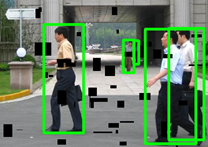 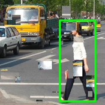 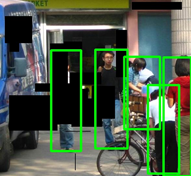 

Here (bottom right image), we see the edges cut out in model type 2 (average patches).

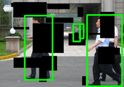 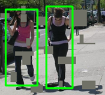 

Lastly, we can look at those two images. We can see that in the right photo which was inferred by the background model identified the reflection of a man (which wasn’t in the ground truth! A proof to that is that it placed him as background on the right side of the picture.  
In the left photo we can see that even the origin didn’t recognize him. It’s an indication that the patches might improve the model.

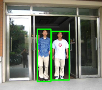 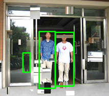

